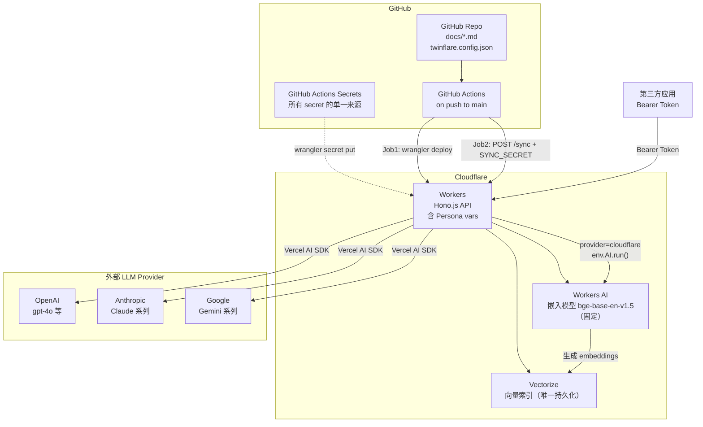

# TwinFlare 产品需求文档 (PRD)

> 版本：v1.0 · 日期：2026-03-12

## 1. 产品定位

- **名称**：TwinFlare — Your Digital Twin, Powered by Cloudflare
- **定位**：面向开发者的 Cloudflare-native 个人 AI 分身平台，以 GitHub 仓库为知识源，通过 GitHub Actions 自动同步向量索引，纯 API 对外服务，无 Admin UI
- **核心价值**：零服务器、知识文档 Git 版本管理、自动向量化流水线、隐私自主

---

## 2. 目标用户

**主要用户**：开发者 / 技术博主 / 个人知识工作者

使用场景：

- 将个人博客/笔记/简历以 Markdown 维护在 GitHub 仓库，push 后自动更新 AI 分身的知识库
- 在自己的网站/应用中嵌入聊天 Widget，调用 TwinFlare API
- 构建知识检索工具（文档语义搜索）

---

## 3. 系统架构



---

## 4. Cloudflare 资源映射

| 资源 | 用途 | 备注 |
|---|---|---|
| **Workers** | API 层，所有业务逻辑（Hono.js） | Persona 配置烧入 `[vars]`，读取零延迟 |
| **Vectorize** | 文档 chunk 向量索引 | 唯一持久化存储，按 `filePath` metadata 增量更新 |
| **Workers AI** | 嵌入模型 | 固定使用 `@cf/baai/bge-base-en-v1.5`，768 维 |

> **R2 和 KV 均不需要**。原始文档在 GitHub，Persona 配置在 Worker vars，向量在 Vectorize。

---

## 5. GitHub 仓库结构约定

```
your-twinflare-repo/
├── docs/                        # 知识文档（只处理此目录下的 .md 文件）
│   ├── about.md
│   ├── projects.md
│   └── blog/
│       └── post-1.md
├── twinflare.config.json        # Persona 非敏感配置（随代码版本管理）
├── scripts/
│   ├── inject-config.js         # CI 用：将 config 注入 wrangler.toml [vars]
│   └── sync.js                  # CI 用：git diff → POST /sync
├── .github/
│   └── workflows/
│       └── deploy.yml           # 部署 + 同步流水线
├── src/                         # Cloudflare Worker 源码
└── wrangler.toml                # Worker 配置（[vars] 由 CI 注入，勿手动编辑）
```

### twinflare.config.json 字段

```json
{
  "persona": {
    "name": "My Digital Twin",
    "systemPrompt": "你是 xxx 的数字分身，基于他的知识库回答问题...",
    "provider": "anthropic",
    "model": "claude-3-5-sonnet-20241022",
    "topK": 5,
    "temperature": 0.7
  }
}
```

支持的 `provider`：`cloudflare`（免费，无需额外 API Key）· `openai` · `anthropic` · `google`

---

## 6. Secret 管理原则

**单一来源**：所有 secret 统一存储在 GitHub Actions Secrets，由 CI deploy job 通过 `wrangler secret put` 写入 Cloudflare Worker。开发者无需在本地执行任何 wrangler secret 命令。

```
GitHub Actions Secrets（单一来源）
        │
        │  deploy job: echo $SECRET | wrangler secret put SECRET_NAME
        ↓
Cloudflare Worker Runtime Secrets
        │
        │  env.ANTHROPIC_API_KEY 等
        ↓
Worker 运行时（LLM provider 初始化）
```

### GitHub Actions Secrets 清单

| Secret 名称 | 是否必填 | 用途 |
|---|---|---|
| `CLOUDFLARE_API_TOKEN` | 必填 | wrangler 鉴权（Workers / Vectorize 权限） |
| `CLOUDFLARE_ACCOUNT_ID` | 必填 | Cloudflare 账户 ID |
| `WORKER_URL` | 必填 | 已部署 Worker 的 URL，供 sync job 调用（首次部署后从 Actions 日志获取） |
| `SYNC_SECRET` | 必填 | /sync 接口鉴权，deploy job 写入 Worker + sync job 直接使用 |
| `PUBLIC_API_TOKEN` | 必填 | 公开 API Bearer Token，deploy job 写入 Worker |
| `OPENAI_API_KEY` | 可选 | provider = openai 时填写 |
| `ANTHROPIC_API_KEY` | 可选 | provider = anthropic 时填写 |
| `GOOGLE_API_KEY` | 可选 | provider = google 时填写 |

---

## 7. 同步流水线（GitHub Actions）

**触发条件**：push 到 main 分支（任意文件变更均触发 deploy；仅 `docs/**` 或 `twinflare.config.json` 变更时触发 sync）

### Job 1 — deploy（每次 push 均运行）

```
1. node scripts/inject-config.js
   → 读取 twinflare.config.json，将 persona 字段写入 wrangler.toml [vars]

2. wrangler vectorize create twinflare-index --dimensions=768 --metric=cosine
   → 幂等，已存在则跳过

3. wrangler deploy
   → 创建或更新 Worker（首次自动创建）

4. 写入所有 secrets：
   echo $SYNC_SECRET       | wrangler secret put SYNC_SECRET
   echo $PUBLIC_API_TOKEN  | wrangler secret put PUBLIC_API_TOKEN
   echo $ANTHROPIC_API_KEY | wrangler secret put ANTHROPIC_API_KEY  # 按需
   ...
```

### Job 2 — sync（依赖 Job 1，仅文档/配置变更时运行）

```
1. git diff HEAD~1 HEAD -- docs/
   → 收集 upserted（新增/修改）+ deleted 文件列表
   → 首次提交（无 HEAD~1）则全量同步所有 docs/ 文件

2. 读取所有 upserted 文件内容

3. POST $WORKER_URL/sync
   Headers: Authorization: Bearer $SYNC_SECRET
   Body: {
     files:   [{ path: "docs/about.md", content: "..." }],
     deleted: ["docs/old-post.md"]
   }

4. 打印同步结果（processed / deleted / totalChunks）
```

> 首次使用只需配置好 GitHub Secrets，push 一次 commit 即完成从零到完整部署的全流程。

---

## 8. Worker API 设计

### 公开 API（`Authorization: Bearer <PUBLIC_API_TOKEN>`）

| Method | Path | 描述 |
|---|---|---|
| `POST` | `/api/chat` | RAG 对话，SSE 流式返回 |
| `POST` | `/api/search` | 纯语义检索，返回匹配 chunks |
| `GET` | `/api/persona` | 获取 Persona 公开信息（name / provider / model） |

### 内部 API（`Authorization: Bearer <SYNC_SECRET>`）

| Method | Path | 描述 |
|---|---|---|
| `POST` | `/sync` | 文档增量同步（upsert + delete） |

---

## 9. RAG 聊天流程

```
POST /api/chat  { messages: [...] }
  → 取最后一条 user 消息，生成 embedding（Workers AI bge-base-en-v1.5）
  → Vectorize.query(embedding, { topK, filter: { type: "chunk" } })
  → 拼装 prompt：
      [System]: {PERSONA_SYSTEM_PROMPT}
      [Context]: {topK chunks 原文，按 score 排序}
      [Messages]: {完整 messages 历史}
  → 路由到 LLM provider：
      cloudflare → env.AI.run(model, { messages, stream: true })
      openai     → Vercel AI SDK streamText + @ai-sdk/openai
      anthropic  → Vercel AI SDK streamText + @ai-sdk/anthropic
      google     → Vercel AI SDK streamText + @ai-sdk/google
  → 流式返回（SSE / text stream）
```

---

## 10. /sync 处理逻辑

```
验证 SYNC_SECRET → 401 if invalid

对每个 deleted 文件：
  1. getByIds([manifestId(filePath)])  → 取 chunkCount
  2. deleteByIds([manifestId, chunkId-0, ..., chunkId-N])

对每个 upserted 文件：
  1. 先执行上述删除（幂等更新）
  2. chunkMarkdown(content) → chunks[]
  3. embedBatch(AI, texts)  → embeddings[]
  4. Vectorize.upsert([manifest, ...chunkVectors])
     manifest  id = "m::{encodedPath}"       metadata = { type, filePath, chunkCount, docTitle }
     chunk     id = "c::{encodedPath}::{i}"  metadata = { type, filePath, chunkIndex, docTitle, text }

返回 { ok, processed, deleted, totalChunks, errors? }
```

**Manifest 模式**（无 KV 的幂等删除方案）：每个文件写入一个零向量 manifest，存储 `chunkCount`；删除时通过确定性 ID 精确清理，无需扫描。

---

## 11. 数据模型

### Worker 环境变量（`[vars]`，由 deploy job 注入）

| 变量名 | 示例值 |
|---|---|
| `PERSONA_NAME` | `"Alex Chen"` |
| `PERSONA_SYSTEM_PROMPT` | `"你是 Alex 的数字分身..."` |
| `PERSONA_PROVIDER` | `"anthropic"` |
| `PERSONA_MODEL` | `"claude-3-5-sonnet-20241022"` |
| `PERSONA_TOP_K` | `"5"` |
| `PERSONA_TEMPERATURE` | `"0.7"` |

### Vectorize Vector Metadata

| 字段 | 说明 |
|---|---|
| `type` | `"manifest"` 或 `"chunk"` |
| `filePath` | 文件路径，如 `docs/about.md` |
| `chunkIndex` | chunk 序号（仅 chunk 类型） |
| `docTitle` | 文档标题（取第一个 H1，降级为文件名） |
| `text` | chunk 原文，直接返回无需回查原文件（仅 chunk 类型） |
| `chunkCount` | 该文件的 chunk 总数（仅 manifest 类型） |

---

## 12. 技术栈

| 层次 | 技术选型 |
|---|---|
| Web 框架 | Hono.js v4 |
| LLM 调用 | Vercel AI SDK v6（`ai` + `@ai-sdk/*`） |
| 嵌入模型 | Cloudflare Workers AI `@cf/baai/bge-base-en-v1.5` |
| 向量数据库 | Cloudflare Vectorize |
| 语言 | TypeScript（严格模式） |
| 构建/部署 | Wrangler v4 |
| CI/CD | GitHub Actions |

---

## 13. 非功能需求

- **部署方式**：完全由 GitHub Actions 驱动，包括 Worker 首次创建、资源初始化、secrets 写入；用户无需本地 wrangler
- **幂等性**：`/sync` 重复推送同一文件不产生重复向量
- **向量容量**：Vectorize 免费版 5 万向量（768 维/向量，约 65 个 chunks）；付费版无限制
- **延迟目标**：Chat API P90 < 3s，流式首 token < 1s
- **错误格式**：统一 `{ error: { code: string, message: string } }`
- **CORS**：默认 `*`，可在 Worker 代码中按需收窄

---

## 14. 里程碑规划

| Phase | 内容 | 状态 |
|---|---|---|
| Phase 1 — Core Worker | Hono.js 骨架、/sync、RAG Chat、/api/search、Bearer Token 鉴权 | ✅ 已完成 |
| Phase 2 — GitHub Actions | deploy.yml、inject-config.js、sync.js、增量 diff 逻辑 | ✅ 已完成 |
| Phase 3 — Polish | README 快速上手文档、mock docs 示例 | ✅ 已完成 |
